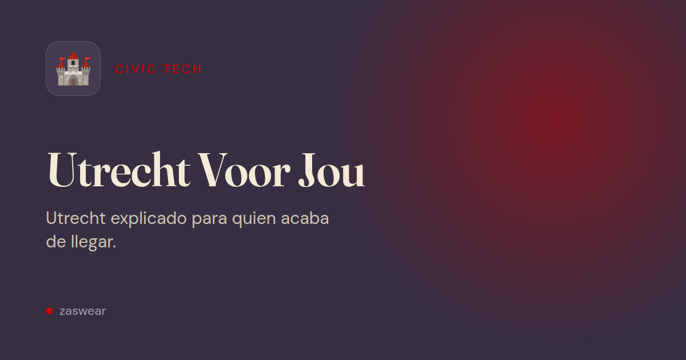

# Utrecht Voor Jou

**A multilingual guide to free benefits, grants and services in Utrecht — the ones almost nobody knows about.**

[Website](https://utrecht-voor-iedereen.github.io/utrecht-voor-jou/) ·
[Report an error](https://github.com/utrecht-voor-iedereen/utrecht-voor-jou/issues/new/choose) ·
[Contributing](CONTRIBUTING.md)

[](https://github.com/utrecht-voor-iedereen/utrecht-voor-jou/actions/workflows/deploy.yml)
[](https://github.com/utrecht-voor-iedereen/utrecht-voor-jou/actions/workflows/link-check.yml)
[](LICENSE)

> **Independent civic project.** Utrecht Voor Jou is not run by or affiliated with the Gemeente Utrecht. It does not decide on applications or run any scheme. The official information is on [utrecht.nl](https://www.utrecht.nl/) and on each organisation's own website.

**Nederlands —** Utrecht Voor Jou zet gratis regelingen, subsidies en voorzieningen in Utrecht op één plek, in negen talen: van de gemeente en van andere organisaties, zoals de bibliotheek, de U-pas en de Voedselbank. Elke regeling linkt naar de officiële bron. Gratis, zonder cookies en open source.



## What it does

- **56 schemes in eight categories** — money and support, green spaces, community, energy and housing, mobility, daily life, legal help, culture — each with who qualifies, how to apply and a link to the official source.
- **Nine languages:** Dutch, English, Spanish, German, Turkish, French, Italian, Portuguese and Brazilian Portuguese.
- **"Am I eligible?" checker:** four anonymous questions, answered entirely in the browser. Nothing is sent or stored.
- **Search by the Dutch term:** each scheme carries its official programme name, organisation and abbreviation, so someone told "Witgoedregeling" or "BghU" at the counter finds it in any language.
- **Filters you can share:** search and filters live in the URL.
- **Printable hand-outs:** one A4 sheet per category with a QR code per scheme, for neighbourhood teams, libraries, language cafés and the food bank.
- **Works offline:** installable, and a page opened once stays readable without a connection.

## How the information is kept accurate

The catalogue matters only if it is right, so the facts are treated as the risky part of the project:

- Every scheme links to its **official source** and carries a status: `verificado` (verified against the source) or `por-verificar` (not yet confirmed).
- Every scheme has a **last reviewed** date. After nine months the site shows a warning on it.
- **Weekly link check** (`link-check.yml`): requests every official URL and opens an issue listing the ones that fail.
- **Monthly review round** (`review-rotation.yml`): opens an issue with the next schemes to re-read against their source, unverified ones first. A link check cannot see that an amount changed.
- **Report an error:** every scheme page has a button that opens a pre-filled correction issue — no GitHub knowledge needed.

`npm run validate` checks the *shape* of the data (JSON schema, the same keys in all nine languages). It says nothing about whether a fact is true; that is what the reviews are for.

## Privacy

No cookies and no tracking. Page views are counted with [GoatCounter](https://www.goatcounter.com/) (open source, no cookies, no stored IP address) so the project knows which schemes people look for. Visitors with Do Not Track or Global Privacy Control are not counted. The numbers are [public](https://utrecht-voor-jou.goatcounter.com/).

A fork or local build makes no external requests: the counter is only added when `site.config.json` has a code, and `GOATCOUNTER_CODE=<code> npm run build` overrides it.

## Run it locally

Requires Node.js 18 or later (CI uses 18 and 20). The site generator has no dependencies.

```bash
git clone https://github.com/utrecht-voor-iedereen/utrecht-voor-jou.git
cd utrecht-voor-jou

npm run validate      # check the dataset and the nine locale files
npm run build         # generate the static site in dist/
npm run dev           # preview at http://localhost:3000/nl/
```

Other scripts:

```bash
npm test              # validation plus the QR encoder test
npm run check-links   # request every official URL (real network requests; not in a loop)
npm run review-due    # list the schemes due for a review against their source
```

> **Service worker.** Once you have opened the site locally, the browser serves assets from its cache. If a change does not show, do a hard reload or enable *Update on reload* under *Application → Service Workers* in DevTools.

## Repository layout

```text
data/beneficios.json          the catalogue: every scheme in nine languages
locales/*.json                interface text, one file per language
schemas/                      JSON schema for the catalogue
scripts/build.js              static site generator (Node, no dependencies)
scripts/validate.js           dataset and locale validation
scripts/check-links.js        checks every official URL
scripts/review-due.js         picks the next schemes to review
scripts/lib/qr.js             QR encoder for the printable sheets
src/css, src/js, src/svg      styles, browser code, illustrations
src/sw.js                     service worker (versioned per build)
.github/workflows/            deploy, validate, weekly link check, monthly review
```

`dist/` is not committed: `deploy.yml` builds and publishes the site on every push to `main`.

## Contributing

The most valuable contribution is a correction: if an amount, a condition or a link has changed, use the **Report an error** button on the scheme page or [open an issue](https://github.com/utrecht-voor-iedereen/utrecht-voor-jou/issues/new/choose). To add a scheme or change the code, see [CONTRIBUTING.md](CONTRIBUTING.md). Please follow the [Code of Conduct](CODE_OF_CONDUCT.md).

## License

Licensed under the [European Union Public Licence 1.2](LICENSE). Scheme descriptions are summaries of public information from the Gemeente Utrecht and the organisations named on each page; the official sources always take precedence.
